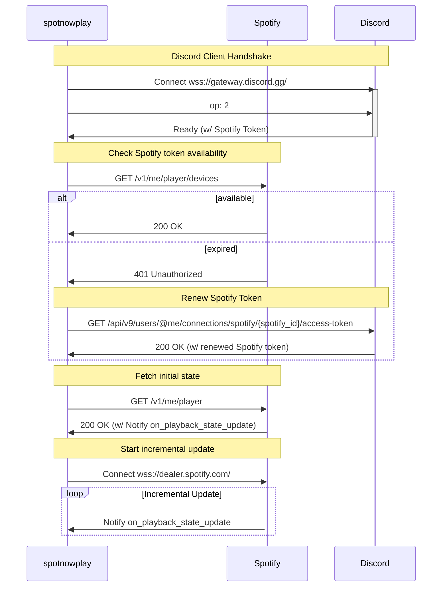

# spotnowplay

Spotnowplay is a Rust library for the interacting with Spotify WebSocket API.

## Disclaimer

I'm not a expert on the Discord ToS and Spotify ToS, and using this software may result in your account being banned.

This software is provided ***as-is*** without any warranty.

## Why does this require a Discord token?

Spotify tokens rotate and expire very quickly.

Discord tokens, however, remain valid for a long time.
Because Discord can generate fresh Spotify tokens for linked accounts, we use the Discord token to obtain valid Spotify tokens.

## How to

### Step 0. Link your Discord account with your Spotify account

This software relies on the Discord–Spotify account connection.
You **must** link your accounts before using it.

Reference: [Discord Spotify Connection – Discord](https://support.discord.com/hc/en-us/articles/360000167212-Discord-Spotify-Connection)

### Step 1. Get Discord's user token by Discord Client

1. Login to [the web client](https://discord.com/login).
1. Retrieve your token using the browser's developer tools.
   Guide: [How to Get Your Discord Token From the Browser Developer Console](https://gist.github.com/MarvNC/e601f3603df22f36ebd3102c501116c6)
1. You will see a token similar to: `"ush9Zohzie6ahmohsoo6meCh.IThah7.jeephaijiachu8kuWoh0aephe5e"`

### Step 2. Run the example

```bash
git clone https://github.com/yanorei32/spotnowplay
cd spotnowplay
export DISCORD_TOKEN="ush9Zohzie6ahmohsoo6meCh.IThah7.jeephaijiachu8kuWoh0aephe5e"
cargo run --example demo
```

## Example Client Implementation

A basic client looks like:

```rust
use spotnowplay::*;

struct App;

#[async_trait::async_trait]
impl EventHandler for App {
    async fn on_playback_state_update(&self, player_state: Option<&api::PlaybackState>) {
        let Some(player_state) = player_state else {
            println!("Inactive");
            return;
        };

        let name = match player_state.item.as_ref().unwrap() {
            api::Item::Track(track) => &track.name,
            api::Item::Episode(episode) => &episode.name,
        };

        if player_state.is_playing {
            println!("Playing {name}");
        } else {
            println!("Paused");
        }
    }
}

#[tokio::main]
async fn main() {
    tracing_subscriber::fmt::init();

    let token = discord_integration::get_available_spotify_token(
        &std::env::var("DISCORD_TOKEN")
            .expect("Specified the Discord token at DISCORD_TOKEN environment"),
    )
    .await
    .unwrap();

    let client = ClientBuilder::new(&token.access_token)
        .handler(App {})
        .build();

    client.run().await.unwrap();
}
```

## Installation

```toml
[dependencies]
spotnowplay = { git = "https://github.com/yanorei32/spotnowplay", tag = "v0.1.1" }
tokio = { version = "1.53.1", features = ["rt-multi-thread", "macros"] }
```

## How it works


